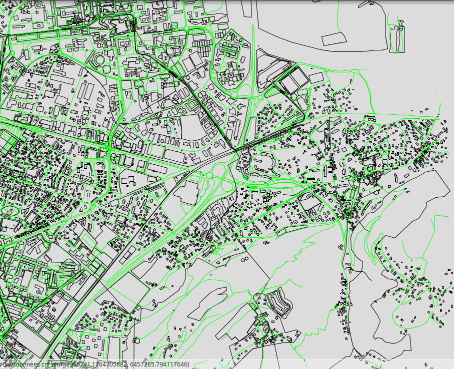

# Java application documentation

## Intruduction

En utilisant le code source fourni pour se connecter au bd postgres et l'interface graphique pour afficher figures geometriques nous avons pu mettre en œuvre quelques classes pour donner une reponse au question du TP et aussi apprendre comme gerer les données geographiques dans une application java.


### Fonctionalites

- Se connecter à une base de données PostgreSQL. (*Question 10*)
- Possibilité d'interroger la base de données ( Requete like ) et utiliser aussi fonctionalites de Postgis pour gerer données geographiques. (*Question 11*)
- Afficher l'ensemble de batiments et routes d'une certaine région. (*Question 12*)

### Architecture

L'application a la structure suivante :

- geo.ensimag
  - tests
    - TestConnection
    - TestLikeQuery
    - TestGui
  - GrenobleMap

nous utilisons le code source fourni comme des dépendances de notre programme.

## Application

### Tests

- Pour résoudre la **question 10** nous avons créé une classe pour faire un test de connexion. Elle se trouve dans le fichier *src/geoexplorer/geo/ensimag/tests/TestConnection.java*. Pour executer le tests il suffi de executer un commande qui affiche le status de la connexion et la reponse d'une requete \dt sur psql :

```
> make question10

Resultat:

INFO: Loading PostgreSQL driver...
Jan 23, 2019 3:58:47 PM database.Utils createConnection
INFO: Trying to connect to Grenoble database...
Jan 23, 2019 3:58:48 PM database.Utils createConnection
INFO: Connected.
Table names command \dt sur psql
*********************************
spatial_ref_sys
users
relations
actions
relation_members
schema_info
way_nodes
ways
nodes
quartier
*********************************

```

- La **question 11** montre l'implementation d'une requete plus complexe où on prend comme entrée une ligne de la terminal et on l'utilisé pour créer une requete.

```
PreparedStatement pstmt = c.prepareStatement(
"SELECT
tags->'name' as nom,
ST_X(geom) as longitude,
ST_Y(geom) as latitude
FROM nodes
WHERE tags->'name' like ? ;");
```
Pour executer le test écrire:
```
> make question11
>> Dom__ne _niversit%

Resultat:

Requete like Dom__ne _niversit%
*********************************
Domaine Universitaire: Coordonées (5.758102,5.758102)
Domaine Universitaire: Coordonées (5.7569486,5.7569486)
Domaine Universitaire: Coordonées (5.7680106,5.7680106)
*********************************
```

- Un autre test développée pour tester l'interface graphique. On crée un point bleu et un objet gui GeoMainFrame avec un MapPanel associé qui affiche le point.


### Map view

- La **question 12** fait la construction d'un polygon qui represent Grenoble et ensuite fait une requete pour trouver l'ensemble des routes et des bâtiments autour de Grenoble.

```
String grenoble="ST_GeomFromText('
POLYGON(
  (5.8 45.1, 5.7 45.1,5.7 45.2,
   5.8 45.2, 5.8 45.1))',4326)";

String q = " select ST_TRANSFORM(bbox,2154) as bboxx , tags->'highway' as hw, ST_TRANSFORM(linestring,2154) as ls
from ways
where ST_Contains("+ grenoble +", bbox )";
```

Pour executer le programme il suffi d'écrire:
```
make question12
```

Resultat:


**Attention:** Faire l'execution de la requete peut prendre un temps considerable. Si vous voulez aller plus vite ajouter au requete un limite de 5000 ou moins pour montrer une partie des données seulement.

Pour finir la description de l'application vous pouvez aussi compiler et netoyer tous les fichier générés avec les commandes:

```
make build
make clean
```
## Problèmes rencontrés

- Des problèmes suivants sur la performance des requêtes vu que la base de données gère une grande quantité de données. La solution pour faire des test été ajouter limit au requete pour limiter la quantité de données a recuperer.

- Ce n'était pas un vrai problème, mais il faut faire attention au système de coordonnées pour faire les requêtes et pour l'affichage qui soient cohérents.
